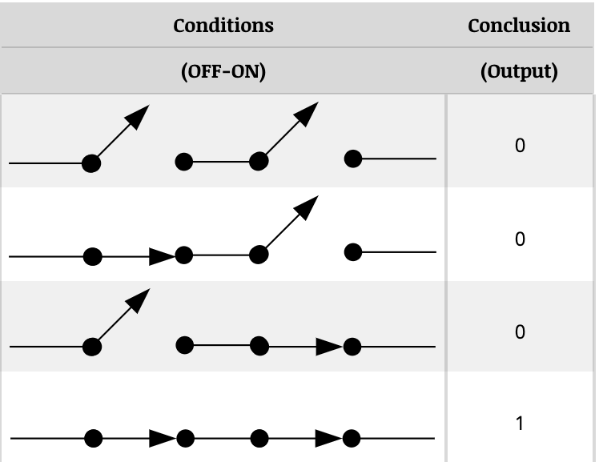
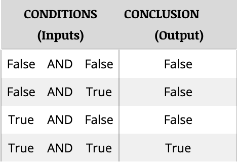
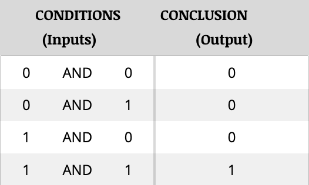
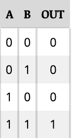
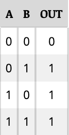
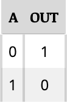

# A. Logic

- British mathematician George Boole created **linear algebra**.
- It assumes that any logical condition is either true or false. It cannot be neither, both or in between.
- If a circuit that is ON means true and a circuit that is OFF means false, logical statements can be thought of as electrical analogies.
- Three basic logic statements are AND (conjunction), OR (disjunction), and NOT (negation).
- A switch which is ON = true = **1**, a switch which is OFF = false = **0**.

Here is an ON-OFF switch equivalent of the AND statement:

Whereas here is the original truth table with text:

Lastly, the numerical table:

Note that for the switch-based truth table, its two consecutive switches on one circuit.

Additionally, here is the function truth table, which emphasizes the input-output side of a logical statement:

Accordingly, here is the function truth table of OR...

...and for NOT:

