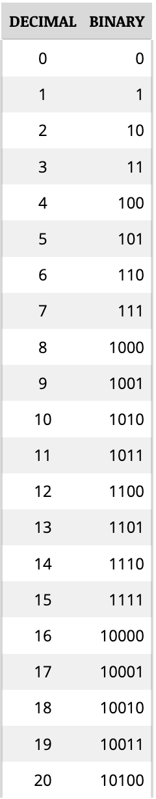
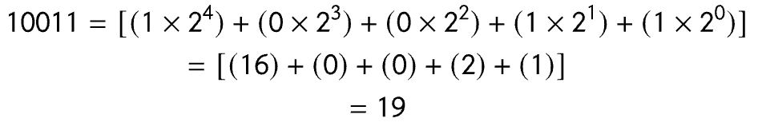

# D: The Binary System

The *ALTAIR 8800* performs most operations in binary. While binary numbers such as 10101101 seem long and meaningless to the uninitiated, they are much simpler than those of the decimal system, which has 10 different digits.

We can count in binary using the same process that we use to count in any other system:

1. Record digits incrementally for each count in a column.
2. When the total number of available digits has been used, begin a new column to the left of the first and resume counting.

We can see this pattern at work in the following table:

A binary number can be converted to decimal by adding the powers of 2 of each placement together:

