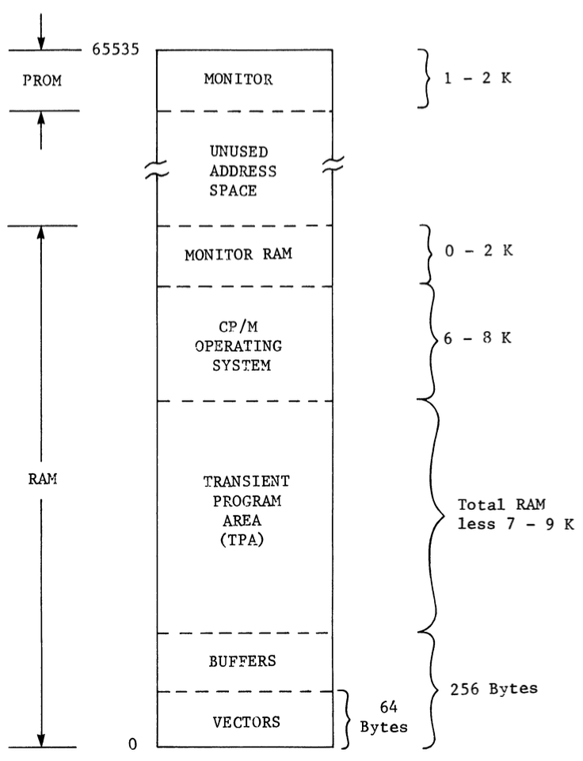

# Software Components Of the Computer System

- The software (not to be confused with "softwear") in a computer system refers to the programming and instructions written into the system which it executes.
- All software used to be loaded in using a switches-and-lights console, similar to that of the *ALTAIR 8800*.
- However, because this process was undoubtedly time consuming, a loader program was soon written.
- Soon came semiconductor RAM, which replaced magnetic core memory. RAM could be accessed more easily, but if the power supply to the computer was ever disconnected, all of the RAM would be lost.
- Finally, manufacturers began putting the loader into the Read-Only Memory (ROM). As Erasable Programmable Read-Only Memory (EPROM, memory that does not loose its data when the power supply is turned off) began to become affordable, lights-and-switches became obsolete.
- This is also where the term firmware was coined. **Firmware** refers to permanent software which has been made "harder" by being burned into the ROM.

This chapter describes the software and firmware components of a computer.

## Firmware monitor

The **firmware** monitor is permanent software stored in the ROM which...

1. uses the console to communicate with the operator.
2. provides routines through which the operator can communicate with the computer.

**Note:** The *console* is the part of a computer used for communicating between the user and the system. This could be a keyboard, a paper tape punch and reader, or a bunch of lights and switches.

Although in our day and age, the word "monitor" has become synonymous with "screen", most old computers did not have visual displays. Instead, they just had consoles through which users could communicate with the computer. Hence, the **monitor** is the software which makes the console "come to life", allowing for two-way communication between the computer and the user. The acronym CP/M, in fact, originally stood for "Control Program/Monitor".

## The operating system

The **operating system** of a computer is the software which manages the computer's basic functions, such as scheduling tasks, controlling the drivers, and executing programs.

The Operating system is NOT firmware; rather, it sits one level above the firmware. It does not directly have to do with the hardware of the computer, but it communicates with it through the firmware.

CP/M is, of course, the operating system we will be using.

[Link to Ved's section of the presentation](https://github.com/dudegod1/csc215)

## Customizing CP/M

- CP/M takes care of all hardware interfacing operations so that the programmer need not worry about them.
- It provides a standard way for interfacing with all hardware: all disk and I/O operations go through one entry point in CP/M.
- This allows programs to interact with hardware in a consistent way.
- Because of this standardized interface, it is possible to write programs for different hardware without making changes to them.
- This versatility makes programs more portable, meaning they can be run on all kinds of devices so long as they are running CP/M.

## Application programs

- The first part of the main memory address space is taken up by the firmware monitor.
- A resident portion of CP/M, that is, the portion which is immediately available in memory and does not have to be loaded from elsewhere, takes up about 6 kilobytes. Some [special memory areas](#special-memory-areas) at the bottom of RAM are also used by the operating system.
- The rest of the main memory is available for user programs.
- The area in RAM used by CP/M to load and execute user programs is called the **transient program area** (TPA).
- TPA begins at a fixed address and includes all RAM not used by CP/M.
- The term **application program** refers to all of the non-system software.
- Application programs for CP/M include CP/M's editor (ED), assembler (ASM), loader (LOAD), and debugger (DDT). They will be loaded into the TPA as we use them.

## Special memory areas

- The lowest 64 bytes of main memory is dedicated to vectors.
- **vectors** are unconditional jump instructions used in some of the most fundamental processes of the computer, such as in starting up.
- Another 192 bytes after vectors compose buffer areas established by CP/M and used to interface programs with the operating system.
- Monitor functions may also take up a special area in the RAM, although this differs from computer to computer and does not even apply for some machines.

## Conclusion

This chapter has taught us three basic types of programs: the monitor, the operating system, and applications programs.

The following memory map shows how all of these components fit into memory in a CP/M based computer:

