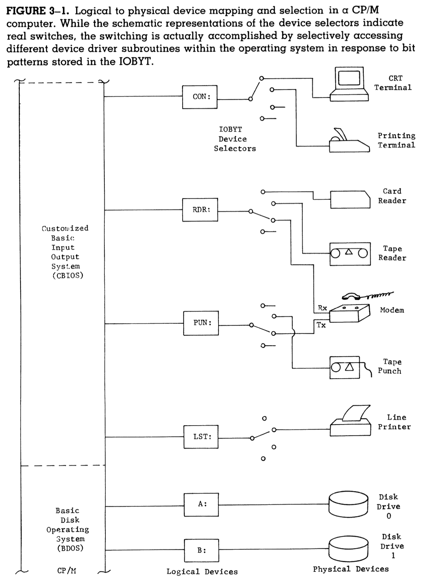

# The CP/M-Based Computer

In chapter 2, we learned that CP/M makes programming in assembly language easier by providing software abstraction for the hardware components of the computer. This feature is what makes CP/M so portable and capable of running on any computer.

Chapter 3 elaborates on *how* exactly CP/M accomplishes such abstraction: it gives logical names to those devices.

## Logical names and physical entities

CP/M uses logical names such as CON:, CRT:, and LPT: to represent the physical devices it is dealing with. The following are the logical names it uses:

### Physical devices

| Logical name | Physical entity |
| ----------- | ----------- |
| CRT: | **CRT:** stands for the computer operator's console video display terminal. It implies a physical device. **Because the CRT: has been plugged into the appropriate port on the computer to serve as the operator's console, it has assumed the duties of the logical device CON:, meaning console.** This is the rule which applies to all physical devices given logical names. |
| LPT: | Refers to the line printer, an output device which connects to CP/M as the logical device LST:, meaning "list device." |
| PTR: | Stands for "paper tape reader." |
| PTP: | Stands for "paper tape punch." |

### Disks

The creators of CP/M did not assign disk drives with three-letter shortened names and colons; instead, the physical disk drives are numbered 0, 1, 2, et cetera. When we select a disk drive we use its logical device name, A:, B:, et cetera. These logical names map one-to-one with physical names in a minimalist system.

| Logical name | Physical entity |
| ----------- | ----------- |
| A: | The disk drive A:. |
| B: | The disk drive B:. |

### Logical devices

| Logical name | Logical entity |
| ----------- | ----------- |
| CON: | Stands for console. When the physical device, denoted by CRT:, is plugged into the port of the computer that allows it to serve as a console, it can be referenced in programs under the logical name CON:. |
| LST: | The logical device that the line printer connects to CP/M as. |

### I/O devices

| Logical name | Logical entity |
| ----------- | ----------- |
| RDR: | A general-purpose input device. |
| PUN: | A general-purpose output device. |

The following is a diagram of some physical devices that CP/M works with, along with their respective logical device names.

