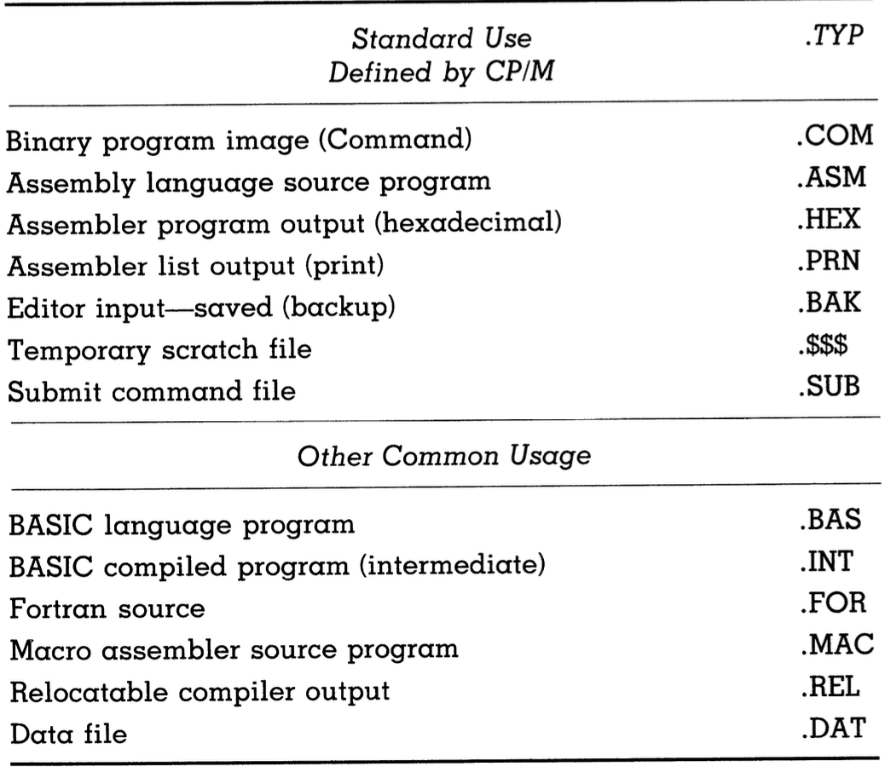

# What the Operating System Provides

This section discusses the CP/M operating system **as it appears to the operator and programmer**. It will also include some of the transient commands provided by CP/M.

## Named file handling

- Files in computers are similar to those in file cabinets: they can contain any sort of information and can have any label, whether it be related or unrelated to said contents.
- CP/M file names, on the other hand, have constraints on them. They can be **up to eight characters long**.
- They have a period and a three-letter type appended to them to create the format FILENAME.TYP.
- Some types are fixed in meaning, while others can be custom.

The following is a table of the default file types used by CP/M:

## Wildcards in file names

- The command `DIR`, when typed into the `A>` prompt of the CP/M console, lists all of the files stored in the `A:` disk.
- However, there is a way to be more specific.
- The command `DIR *.COM` lists all entries with a file type of `.COM`, which stands for COMmand.
- The `*` in `*.COM` is a wildcard that represents eight placeholder characters. `*.COM` is the same as `????????.COM`
- Any number of ?'s can be used in a filename in the place of letters to help with searching for files.
- For example, suppose you had a program called `PROG.ASM`. You also have different versions of it called `PROG1.ASM`, `PROG2.ASM`, `PROG3.ASM`, et cetera. You could find all of them by entering `DIR PROG????.ASM`
- You could also enter `DIR P*.ASM`, but this would be more ambiguous and include any filename starting with a P, such as `PINEAPPLE.ASM`, `PI.ASM`, `PENCIL.ASM`, and so on.
- The characters `*.*` represent all files. One application for this is the command `PIP B:=A:*.*`, which tells the Peripheral Interchange Program (PIP) to copy all the files from drive `A:` onto the disk in drive B:.
- The file system is one of the most useful features of the CP/M operating system. It makes programming much easier.

## Locial unit access

- In chapter 3, we learned about how CP/M maps logical to physical devices.
- CP/M provides the console operator AND user programs with access to logical units and by proxy to physical units.
- Thus, the operator can access a logical unit from the console with the command such as `PUN PUN:=FILENAME.TYP`, which sends the named file directly to the physical device attached as the logical device `PUN:`.
- A program can also access any of the logical devices without even knowing what physical devices may be connected.
- This allows for portable, general-purpose programs.

## Line editing

- CP/M offers support for certain keyboard combinations which can be helpful while entering a command line in response to the `>` prompt.
- You can view the command you are about to execute using the code `CTRL + R` (Mac users have to use the `control` or `^` key).
- You can delete your entire line using the code `CTRL + X`.
- You can go to a new line without executing the command line with `CTRL + U`.
- These are the only combinations you will ever need.
