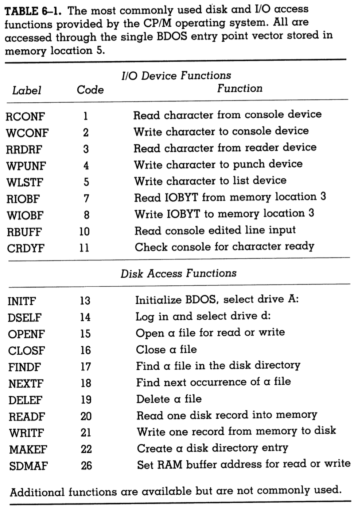

# Interfacing With CP/M

CP/M abstracts and simplifies many tasks for a user friendly experience. Thus, a multistep program gets turned into a single one-line command.
CP/M provides many labor-saving facilities, and so it would be redundant to place the burden of those facilites on user programs. Instead, user programs should use the resources given to them by the operating system whenever possible.
Hence, this section elaborates on said resources.

## The "giant hook" at location 5

- [The image from chapter 5](/Assembly_Language_Book_Notes/ch_5/ch_5_image1.png) showcases all of the different facilities provided by CP/M.
- user transient programs can access all these facilites through the **BDOS CALL VECTOR** written in memory location 5.
- This vector can be seen in the [vector table from chapter 5](/Assembly_Language_Book_Notes/ch_5/ch_5_image3.png).
- **This vector is the "hook" off which we hang requests for I/O and disk access services.**

### Good programming practice

- Since we are assembly language programmers, we know the architecture of our devices;
- thus, we can easily access the disk and I/O drivers stored within the PROM by using direct memory addresses.
- However, this is not as portable as each computer system has different memory locations for its drivers;
- hence, a program which accesses those drivers directly has to be rewritten for each computer and each version of CP/M.
- Each version of CP/M and each device, however, knows where its BDOS ENTRY point is located in RAM; so, it can set the location 5 jump instruction point, itself.
- Such portability will become more and more important as your programs advance in complexity; thus, you should use CP/M's BDOS CALL VECTOR.

Here is a table of common disk and I/O access functions that CP/M provides:

And that concludes a summary of the resources provided to users by CP/M.
