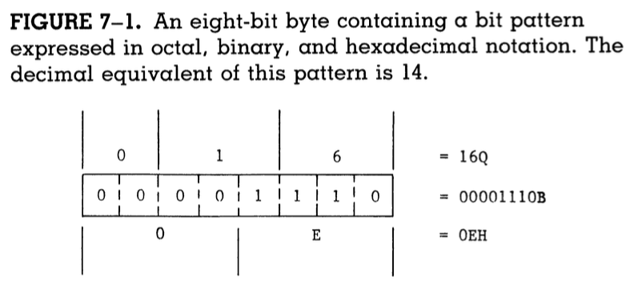
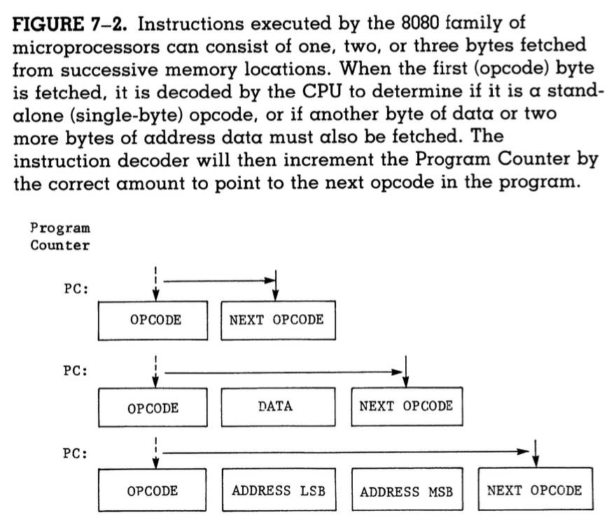
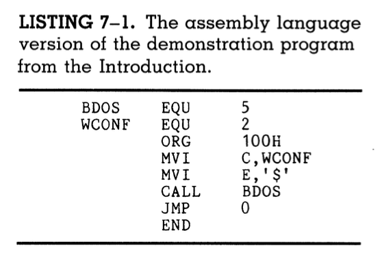
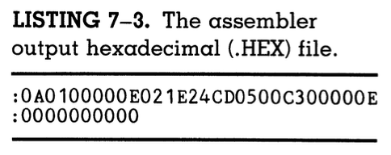
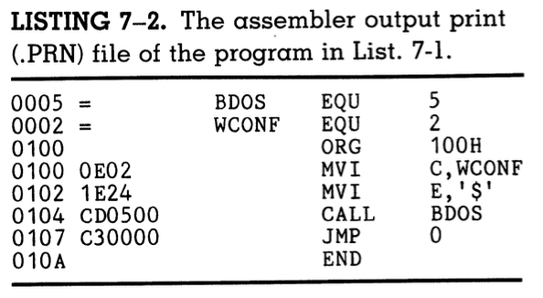
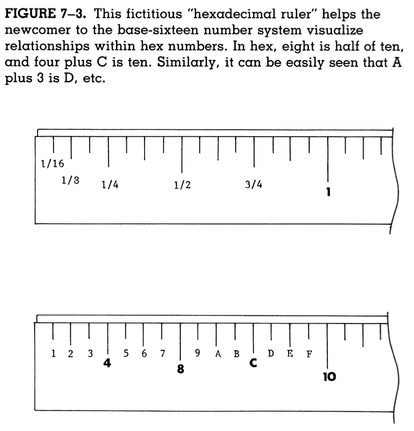
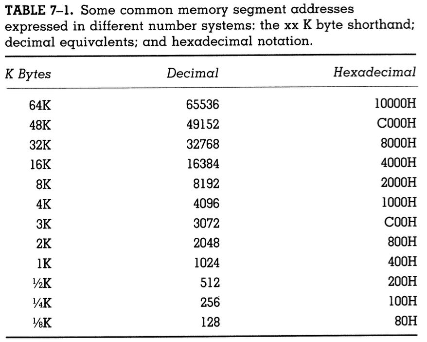

# Assembly Language Programming

## Machine language

### Layers of abstraction

#### TRUE machine language

- In the introduction, you keyed in a basic "machine language program," i. e. a program in hexadecimal.
- In truth, that is not machine language; the only language which machines understand is that of low and high voltages which amount to `1` or `0`, true or false, and so on.
- In true machine language, the first instruction would be `0V 0V 0V 0V 5V 5V 5V 0V`.
- The computer begins each instruction cycle by fetching an opcode (an 8-bit pattern) from memory and placing it in the instruction register.
- In the storage elements of this register, each bit will be a high or low voltage depending on the instruction.
- This set of eight voltage levels, known as a **byte** when represented in binary, is TRUE machine language, i.e. its the language which the machine understands without having to compile, interpret, or put it through any other process before running.

#### Binary

- The instruction `0V 0V 0V 0V 5V 5V 5V 0V` is, of course, not very human-readable, so instructions can instead be represented with one layer of abstraction: a `1` digit to represent voltage high and a `0`digit to represent voltage low.
- Converting like this turns the command into `00001110`.
- If you were using a switches-and-lights console, you would have to enter the binary digits one by one either up or down depending on the bit.
- However, in today's day and age, writing entire programs with just 1s and 0s while having a full keyboard is tedious and unnecessary.
- Plus, such programs would be very hard to look through, as human programmers can only recognize so many different patterns of binary bits.
- Thus, another layer of abstraction was required.

#### Octal

- Using sets of three octal digits to represent sets of eight binary digits was the first layer of abstraction developed by programmers.

The following image shows how this was done:

#### Hexadecimal

- Hexadecimal is, like octal, another way of representing binary digits.
- However, while one octal digit can represent three binary digits, one hexadecimal digit can represent four.
- This means that one byte of binary can be represented with just two hexadecimal digits, which makes hex very useful for representing longer strings.
- Hex numbers which start with letters are often preceded by a 0. Hex numbers in general are also followed by an "H" to represent "hex".
- Likewise, octal numbers are followed by a "Q" and decimal numbers by a "D".
- So, 15D = 17Q = 0FH.
- Because hexadecimal is so compact and is a direct representation of binary, it is the closest we can get to machine language without having to communicate in voltages.

### Opcodes

- Not every instruction fed into the computer is a code representing an operation.
- Some tell the CPU to fetch data stored in the address written in the next 16 bits and to place it in a register.
- Keep one thing in mind: some opcodes are followed by 8 bits of data, and others are followed by a 16-bit address.

The following image shows the different instructions which can follow any given opcode:

## Assembly language

- Although hexadecimal is certainly more compact that long strings of 1s and 0s, it's still not entirely readable by humans.
- This is where assembly language comes in.
- Assembly language is precisely one level of abstraction above hex machine langugage.
- It places labels on machine language instructions so that humans can read and understand a program.

### A breakdown

- For example, take a look at the following program from the introduction:

- The task of this program is to send the '$' character to the CON: device.

#### Calling BDOS

- The easiest way to do this is to make a BDOS system call through memory location 5.
- The first line defines the absolute memory location 5 under the name "BDOS".
- Defining the location of BDOS within the program makes it more portable for operating systems with a different absolute location for system calls.
- To make the program run on a different system, you can simply change the 5 and the assembler will use the new value wherever the symbol BDOS appears.

#### Write console function

- Similarly, the mnemonic `WCONF` stands for "write this character on the console function."
- The symbol can actually be whatever you want it to be, so long as it's 16 characters or less. It should also be meaningful so you remember what the function does.

#### `ORG`

- The next uses `ORG`, a pseudo-operation telling the assembler that this program will be executed at address 100 hexadecimal in memory.
- `ORG` is a pseudo-operation because it doesn't translate into a machine language operation; rather, it's a directive to ASM.

#### `MVI`

- In the next line, `MVI` stands for "move immediate value," which places the specified value directly in the given register.
- So, the line `MVI    C,WCONF` says "loadd the function code symbolized by WCONF directly into register C."
- The next line also uses `MVI`, this time to load the '$' ascii character into register E.

#### `CALL`

- The next line performs the system call.
- CP/M will decode the function in register C and send the contents of register E to the logical device `CON:`.

#### `JMP`

- Once call finishes, the computer will begin searching through memory for something else to do.
- The `JMP` statement places the CPU back to location 0, which is where the vector to return to CCP is stored.

#### `END`

- The last line is another pseudo-operation, END.
- This tells the assembler that it has reached the end of the program, and that no more source code is to be processed.

### Output files

When the assembly language source code is passed through CP/M's assembler, it renders two output files:

#### Hexadecimal file

- The first output file contains the machine language program in human-readable format.
- It contains of a hexadecimal representation of the machine language program along with some other information.

Here is a picture of the assembler's output hexadecimal file for the program above:

#### Source program

- The second output file contains a listing of what ASM did with the source program.
- This is useful for debugging programs.

The following is an image of the source program output for the above program:

### Running the program

- Before running this program we have to convert it from a .HEX file to a .COM file.
- The CP/M transient utility LOAD will read the .HEX fil and produce a .COM file.
- Typing the command `LOAD FILENAME.HEX` into the console will produce `FILENAME.COM`, which you can then execute just by typing `FILENAME`.

And that is the entire process required to assemble, load and run a program.

## Hexadecimal numbers

- Early humans created the base 10 number system because we each have ten fingers; therefore, it seemed natural.
- In reality, hexadecimal is more natural.
- If you exclude your thumbs from counting, then hold both your hands up, you get an eight-bit byte expressed as two four-finger hexadecimal digits!
- Most things in nature also come in two's and not tens. For example, during mitosis, one cell breaks into two.

Here is a hypothetical "hexadecimal ruler" which takes advantage of the 16ths of an inch:

### Easy representation of memory

The relations between memory size in K bytes and the equivalent hex addresses form simple sequences. Only the decimal numbers are complicated, because they are not natural.

The following table shows the simplicity of hexadecimal:

Therefore, using decimal instead of hexadecimal in regards to computers is as inconvenient as using imperial instead of metric units in regards to measuring things. This is why most computer subjects are described and discussed in either binary, octal or hexadecimal.
