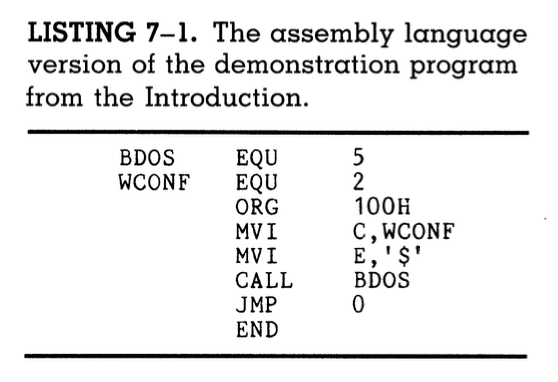

# Register Usage In the 8080

A **register** is a type of computer memory built into the CPU which is used for handling and manipulating data during the execution of instructions.

Although a processor can point to any one of the 64K bytes in the RAM, there are three reasons why we still want hardware registers:

1. **Speed**: Data in memory must be retrieved using a fetch opcode. Data in registers, on the other hand, can be operated on much faster as it is already in the CPU.
2. **Portability**: The standard 8080 registers remain a constant feature on any CP/M based computer.
3. **Multiple indexes**: Some data will have to be stored in memory in most programs; so, having many registers which can point to locations in memory simplifies programming tasks.

Having more programmer accessible hardware registers is always better. The 8080 chip provides enough registers for most tasks.

## Register organization and data paths

Along with knowing about the available registers, a programmer must also understand the *paths* that data follows between registers, the ALU, and everything outside the CPU chip.

### Registers within the CPU

|Register name|Register purpose|
|-----------|-----------|
|A          | The **A register**, also known as the **accumulator**, provides one input to the **arithmetic/logic unit (ALU)**. The other input comes from the data bus.|
|F          | The **F register**, also known as the **flag register**, holds condition bits which convey information about the results of an operation performed by the ALU. The F register can tell us if two quantities are equal in size, or which one is larger, or if we have reduced a count to zero, or if it overflowed the accumulator. If an operation has overflowed the accumulator, the overflow will be stored in the **carry bit**.|
|B, C, D, E, H, L | Registers **B, C, D, E, H and L** are **general purpose**. They can serve as other inputs to the ALU, opposite the contents of A. They can each individually be addressed for eight-bit operations, and the paired registers BC, DE, and HL can be selected for 16 bit and stack operations.|

Here is a diagram showing register organization and data paths in the 8080:

>*The A register and the 8-bit data bus supply operands to the ALU.*
>
>*In the BC, DE, and HL register pairs, the registers shown on the left in the figure conain the most significant eight bits, and the righthand ones contain the least significant bits.*
>
>*The AF register pair is unique because it is only involved in the stack operations PUSH and POP. These registers do not participate in 16-bit operations. They are linked only for stack operations. This pair is called the **program status word (PSW)**.*

Here is another diagram showing the bits of the flag register:

### Extra Terminology

- A register pair is said to be an **index register** when the 16-bit value of the pair is used as a pointer to a memory location.
- When paired, the pair BC is referred to simply as the B register, DE is referred to as D, HL as H.
- So, in the instruction `LXI H, 32767` loads the HL register pair with the value 32767.
- `LXI` stands for **L**oad inde**X** with **I**mediate data. The data which follows the instruction immediately in the program is loaded into the pair.

### Referencing registers

Here is a diagram showing how instructions can reference certain registers using three-bit codes:

- Each opcode which affects the contents of registers contains a three-bit address field.
- because three bits form eight combinations, three-bit addresses can be used to individually address each of the registers mentioned in the table above.

## The M register

- The **M register** is not actually a register; it actually just the contents of the memory loaction addressed by the HL index.
- The "M" can stand for "memory," because this register stores the contents of certain addresses in memory.
- The HL pair is also referred to as the **index register** because it is always the index for operations involving the memory register M.

### Uses

- The M register is arguably the most powerful and versatile register in the 8080.
- For example: let's say you're programming a clock in your computer. You have to track the year, day, hour, minute, and seconds of the current moment.
- You can dedicate one eight-bit value to each of these and go on incrementing them.
- This would not be possible with registers alone, because there simply isn't enough registers in the 8080.
- Instead, you can assign a memory address to each value and increment through those addresses using the HL register pair.
- Whenever an address appears in the HL pair, its contents in memory will appear in the M register, thus allowing them to be incremented.
- So, you can go on moving through and altering memory using the index and M registers.

The following diagram illustrates this process:

>*Because it can hold anything, the M register is not just one register; it is as many as we have 8-bit slots in memory.*
>
>*Incrementing the index register points to successive M registers in turn.*
>
>*This makes it easier for programs to operate on a list of values such as in this clock program.*
>
>*The power of the M register is that **you do not have to load its contents to the accumulator** before performing move, arithmetic or logical operations to it, as all of those operations are also applicable with the M register.*

## Stack operations

- The **stack** is a memory area pointed to by the stack pointer (SP) and accessed by the stack operations.
- **Stack operations** include:
  - the register save operations PUSH and POP,
  - subroutine calls and returns,
  - Hardware and software interrupts.
- Lets say you run out of registers while programming. All of them are holding important values, and even the index register is already pointing to an address.

### An example program

- The following program shows an example of what to do in such a situation:

- Here's what is happening:
  - The instruction `PUSH B` temporarily frees up the C register by PUSHing the contents of the BC pair onto the stack, thus saving the values stored in them.
  - The value of the variable `COUNT` is stored in register C, while register B remains unused.
  - This allows us to enter the loop.
  - The count is immediately decremented via the instruction `DCR   C`.
  - Then, the program checks to see whether the count is zero using the `JZ` instruction, which stands for **J**ump if the result of the last operation was **Z**ero.
  - If the counter is NOT zero, the program will perform one iteration of the instructions represented by the lines of dots.
  - If the counter IS zero, the program will jump to the `JUMP LOOP` instruction. This is an unconditional jump back to the location labeled LOOP.
  - At the `END:`, the program restores the original contents of BC by POPing B off the stack, which also restores the contents of SP (the stack pointer) to its origianl value.
- This program demonstrates how the stack can be a handy place to hold values and take them out when they're needed.

### Stack use in subroutines

The stack is also used to save the return address when a subroutine is called. Take the program discussed in chapter 7, for example:

- Here is what happens in this program:
  - The `CALL BDOS` instruction, located at 104H, automatically pushes the contents of the **program counter (PC)**, which stores the address of the next instruction, to the stack.
  - The PC is then loaded with the address of the BDOS vector, which is location 5 or 0005H.
  - So, the program begins executing the primitive functions of BDOS to interface with the disk.
  - BDOS does the job of decoding WCONF and sending the data in register E to the console.
  - Throughout all of this, address 0107H is stored on top of the stack;
  - When the primitive functions finish executing, BDOS executes a return (RET) instruction, which pops the contents of the top of the stack and places it into PC.
  - This way, the next instruction is fetched from 0107H, and we're back in the user program.
- Hence, this program serves as an example of how the stack is used for subroutines.

## Register use by the user

- The A register is the most used register, since it always serves as one of the inputs to the ALU.
- The F register is not a programmer accessible register; it cannot be addressed or have data moved in and out of it.
- The H and L registers can be used individually as eight-bit registers; however, it is easier to make them one index register which provides access to the M register.
- In summary, programmers can access four 8-bit registers that can be linked to form two 16-bit indexes.
- It is important to always use the same registers for the same purposes in all of your programs. Doing so will make it easier to keep track of what's going on in a long program.
- Here are some **guidelines for register usage**:
  - If a second index register is needed in a program, it is most convenient to use the pair DE.
  - Because the word "counter" starts with C, the C register can be used all the time as the counter register.
  - The A register is where 8-bit values should be passed, since A can't be paired to form a 16-bit value AND since it will have to be used for something in every subroutine we call.

### Subroutines and registers

- Subroutines which are going to use registers other than A should save and restore the contents of those registers.
- Subroutines should always be written in such a way that, upon returning to the program calling them, all registers except the accumulator will be restored to their original state. This will prevent you from losing data.

### In summary

- Pass 8-bit values in the accumulator.
- Expect subroutines to destroy the accumulator's contents in the process of execution.
- Dedicate HL as the number one memory pointer; use DE next, if you need it.
- Save C for an eight bit counter, and BC for larger counting jobs.
- Write subroutines that will return the contents of registers B, C, D, E, H, and L unchanged. Register A, however, can be changed.

This sums up the general guidelines for register use in user-made programs.

## Register use by the system

- The term **system** refers to the software environment you have to work within, i.e. the CP/M operating system and whatever firmware comes with your computer hardware.
- The CP/M operating system itself was developed on an Intel **Microcomputer Development System (MDS)**. This system determines the way that CP/M uses the available registers of the 8080 processor.
