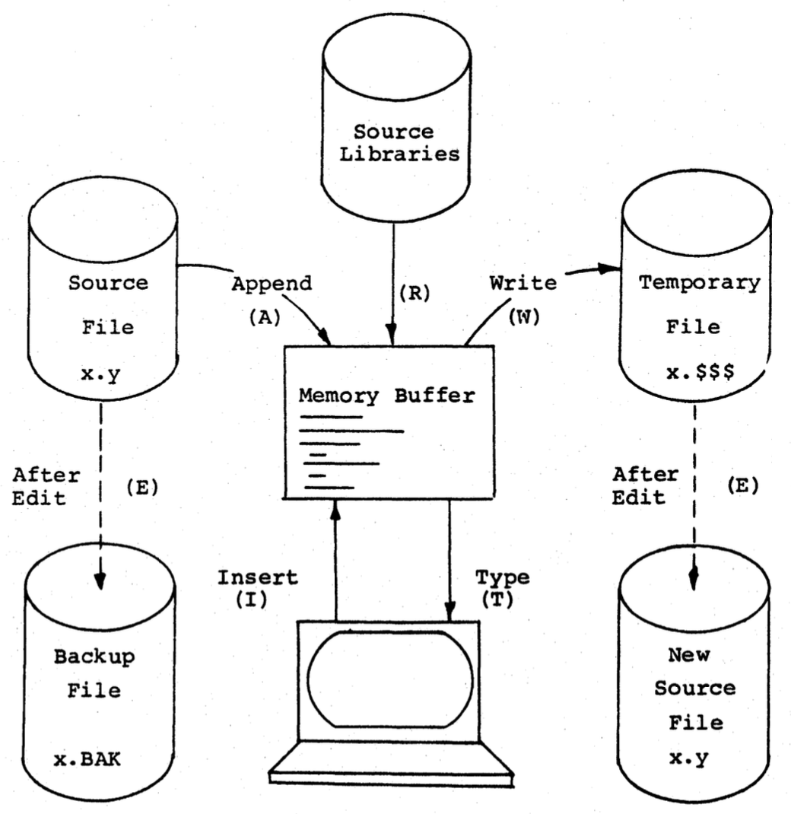
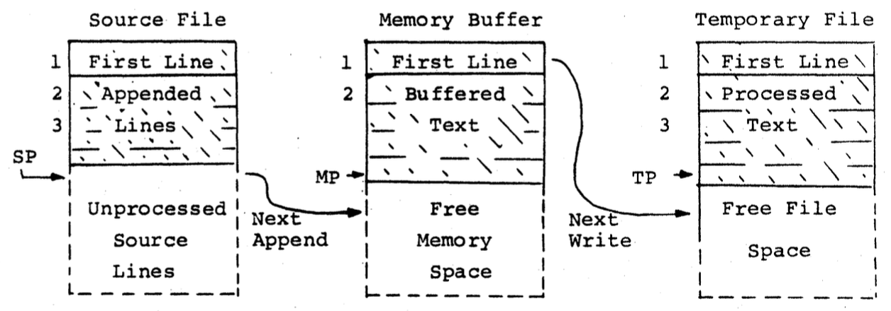
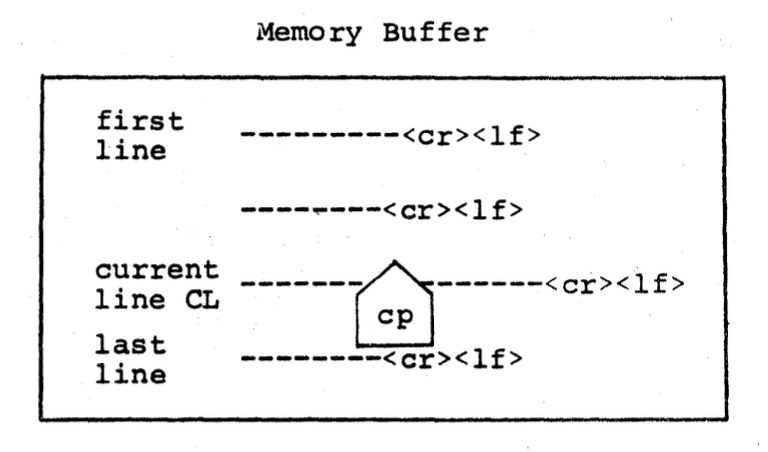

# Introduction to ED

This document provides a simple introduction to the inner workings of ED.

## ED is a LINE EDITOR

- In our day and age, we are most commonly used to **screen editors**, which are editors where the user can see a cursor, easily copy, paste and cut text, and use a mouse pointer.
- ED, however, is a **line editor**. This means that you can only edit one or a certain number of lines of a file with ED; you cannot have a continuous stream of characters.
- The editor was built like this because early versions of CP/M had limited RAM and thus were prone to making partial edits and corrupting files in the event of an overflow.

## Basic editing process of ED

Here's a rundown of the process of editing a file in ED:

### 1. Initialization

ED is initialized in CP/M by executing either the `ED <FILENAME>` or `ED <FILENAME>.TYP` command.

### 2. Uploading the source file into the memory buffer

- Once ED is initialized on a source file, part of the source file is loaded into a memory buffer.
- A **memory buffer** is a temporary storage space in the RAM where part of the file is held. The part of the file which is held in this buffer can be viewed and altered using ED.
- This buffer has a limited size. In a 16K CP/M system, it cannot exceed 6000 characters in size.
- This means that not all of the file cannot be loaded into the buffer at once, so ED can only edit parts of the file at a time.

### 3. Editing

- While the user is editing the file, ED allows you to make changes in the buffer.
- The buffer serves as a temporary working area in memory.

### 4. Temporary file

- As the user makes changes to the buffer, they are written to a temporary file on the disk.
- This temporary file has the same name as the original source file but with the extension `$$$`. So, it is formatted `FILENAME.$$$`.
- CP/M maintains a temporary file during the editing process so that the original file remains unchanged until the user is finished editing.
- If something suddenly goes wrong during editing, such as a system crash or error, the original file will remain intact.

### 5. Finalizing changes

- Once editing is done, the user exits ED using the `E` command.
- When the user exits, three things happen:

1. ED writes the content of the memory buffer, along with any text in the original source file that has not yet been loaded into the buffer, into the temporary file.
2. The original source file, `FILENAME.TYP`, is renamed to `FILENAME.BAK`, which stands for "backup." This makes it so that even if the temporary file is corrupted, the previous version of the file remains intact.
3. The temporary file `FILENAME.$$$` is renamed to be the original file, `FILENAME.TYP`.

This whole process takes place whenever the user opens a file using ED, makes changes, and writes the changes using exit.

Here is a diagram in the ED manual showing the editing process:

> *ED writes and reads from the memory buffer.*
>
> *ED reads from the source file in the disk and appends it to the memory buffer, allowing the user to edit the file in sections.*
>
> *ED writes changes made to the temporary file.*
>
> *All of keeps happenning during editing.*
>
> *After editing is finished, files are renamed and content is stored as mentioned above.*

Here is a diagram showing the organization of the memory buffer during ED's operation:

> *During editing, lines of the source file are repeatedly appended to the memory buffer on command of the user.*
>
> *As the buffer space gets full, the user can keep appending lines of edited text (which is labeled "processed text" in the diagram) to the temporary file to free up space.*
>
> *SP, MP, and TP represent source pointer, memory pointer and temporary pointer, respectively. These pointers help ED know where in source file, memory buffer and temporary file to read from and write to.

And another diagram on the memory buffer:

> *The CP (character pointer) sits where the user is currently editing within the memory buffer. It can be moved around on the commands of the user.*
>
> *The \<cr> represents a carriage return or newline, while the \<lf> represents a line-feed, or going down one line without changing the horizontal position of the  character pointer.*

This concludes a general overview of the inner workings of ED.
