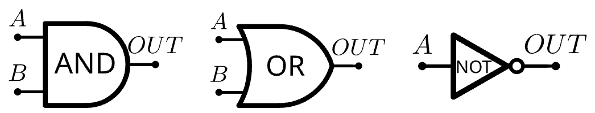
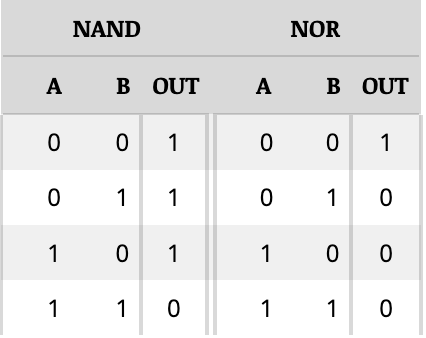
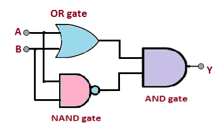
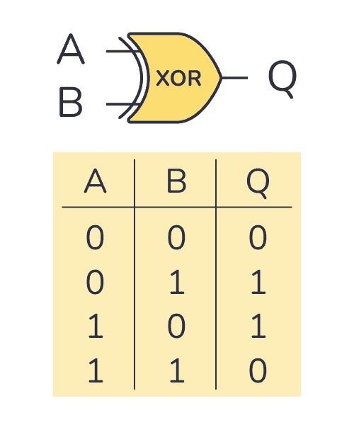
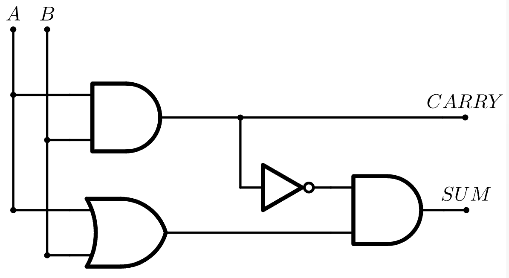
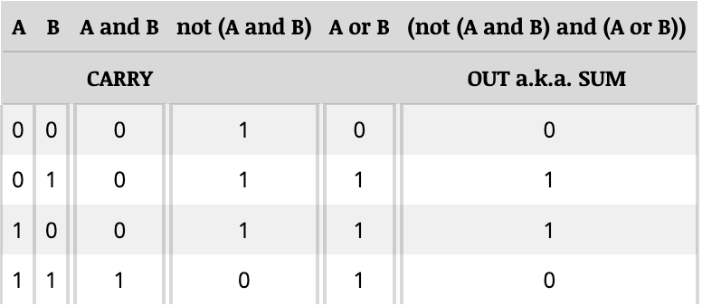
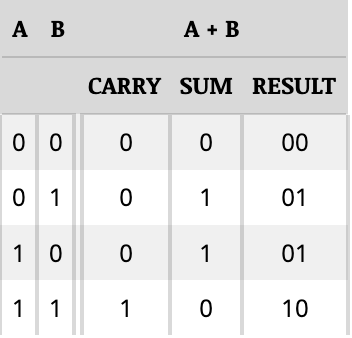

# B: Electronic Logic

Part A taught us that the 3 basic logical operators, AND, OR and NOT, can be represented by switches that are ON or OFF. In a computer's case, these switches would be called **transistors**.

The following is a symbol for each logical operator's transistor circuit:



Two of these logical operators can be chained together to create new ones. Examples of this are **NAND**, which is the logical negation of AND (NOT-AND), and **NOR**, which is the logical negation of OR (NOT-OR).

The following are the function truth tables of NAND and NOR:



Three or more logic circuits make a **logic system**. The following is an exclusive-OR (XOR) circuit:



XOR is a logical operator that returns true if the two inputs provided do NOT equal each other. The following is the truth table and symbol for XOR:



XOR can also be used to add in binary. Take a look at this:

``` txt
0 + 0 = 0
0 + 1 = 1
1 + 0 = 1
1 + 1 = 10
```

It matches XOR, does it not? Even for `1 + 1`, the sum is 0 and you carry the 1. In fact, when used for addition, the XOR gate can have two outputs: a carry value and a sum.



In this case, the NAND is broken into an AND and a NOT because the AND determines if there is a carry or not. If two `1`s are added together, that will equal `2` in base 10. However, because binary *has* no digit `2`, it becomes `10`, hence the `0` becomes the sum and we carry the `1`.

Here is the truth table for addition in binary:





## Other

- Logic circuits can be combined into **monostable circuits**, which occupy one of two states unless an incoming pulse is recieved, and **astable circuits**, which continually switch back and forth between two states.
