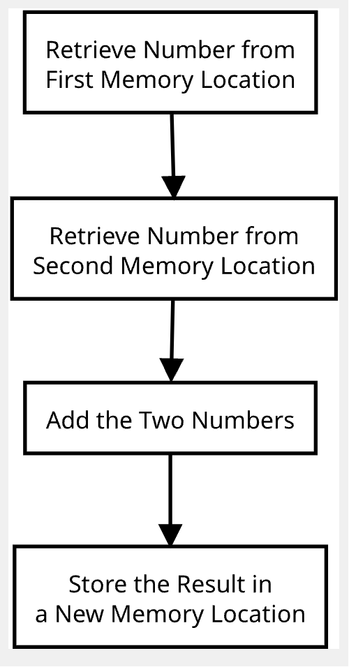

# G: A Simple Program

Let's say you want to add two numbers at different memory locations and store the result in a third location. The following is the process to follow to write a program to solve this problem:

1. **Define the Problem:** Add two numbers located in memory and store the result elsewhere in the memory.
2. **Establish an Approach:** You can use a flow diagram for this:

3. **Write the program:** Translate the program into computer language. Knowledge of the computer's organization and operation makes this easier. The flowchart above translates into five separate instructions:

These instructions will make more sense later on.
