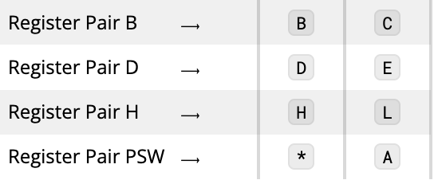

# A: Central Processing Unit (CPU)

## Purpose of CPU

A CPU...

1. performs all arithmetic calculations.
2. makes all logical decisions.
3. controls access to the computer by input and output devices.
4. stores and retrieves data from the memory.
5. coordinates the orderly execcution of a program.

## Major Systems

The CPU is the most complicated part of the *Altair 8800*. A block diagram of the CPU is shown in the introduction to this chapter. While you don't need to know this diagram like the back of your hand, here are the roles of some of the CPU's major systems:

### Timing and Control System

Recieves timing signals from the clock and sends them to certain portions of the CPU to ensure that instructions are coordinated properly. This system also controls front panel status indicators such as HOLD, WAIT, INTE, STACK, OUT, IN, INP, MI MENR, HLTA, WO, INT.

### Instruction and Register System

This system decodes binary machine code so it can be executed by the CPU.

### Arithmetic System

Performs binary *and* decimal arithmetic. In a CPU, all arithmetic is addition. Multiplication is repeated addition and subtraction is inverse addition.

### Working Registers

CPU has **seven 8-bit registers**. The most important register is the Accumulator, which is where the results of operations are loaded.

**Note:** A **register** is a quickly accessible location abailable to a computer's processor. Registers usually consist of a small amount of fast storage.

The six remaining registers are grouped into pairs so they can perform 16-bit operations together. These are called **scratchpad registers**, and they are used regularly to store temporary data or addresses or to conduct program operations.

Here is a table showing the arrangement and classification of the Working Registers:

### Status Bit Register

Note that in the table above, there is an additional register next to the accumulator, represented by an asterisk. This register is called the **Status Bit Register**. It is used to store the status of certain operations. Though it is an 8-bit register, only 5 of those bits are used. Each of these 5 bits have a special purpose:

1. The **Carry Bit** is used for addition, subtraction, rotation, et cetera. It is set to `1` if a carry has occurred and `0` if no carry has occurred.
2. The **Auxilary Carry Bit** indicates a carry out of bit 3 of a result if set to `1`. If set to `0`, there is no carry.
3. The **Sign Bit** is used to indicate the sign of an operation's result. If it's set to `1`, the result is negative; if it's set to `0`, the result is positive.
4. The **Zero Bit** is set to `1` if the result of an operation is `0`. If the result is greater than `0`, the Zero Bit is set to `0`.
5. The **Parity Bit** is set to 1 if the parity of an operation's result is even; otherwise it is set to 0. **Parity** refers to the number of `1` bits in the result.

### Program Counter

The Program Counter is a special 16-bit register which stores the address of the next program step to be executed. It automatically advances to the next program address upon the completion of one step.

### Stack Pointer

This is another special 16-bit register. It stores the address of the **stack**, a section of memory reserved for temporary storage of data or addresses.

In summary, here is how all these components work together:

- The Working Registers, which include six scratchpad registers and an Accumulator, store the results of operations.
- The Program Counter ensures sequential execution of a program by storing the memory address of the next instruction to be executed.
- The Timing and Control System ensures orderly execution of the program through use of timing signals.
- The Stack Pointer stores temporary data.

This all contributes to a powerful and flexible CPU.
