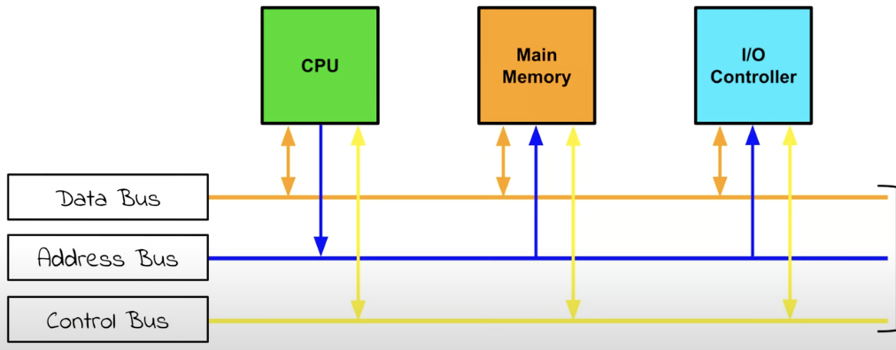

# System Bus

## Introduction

**Buses** are circuits on the motherboard that connect the CPU to other components. There are many buses on the motherboard.

The **Data Bus**, **Address Bus**, and **Control Bus** together make up the **System Bus**, which is a single computer bus that connects the major components of the computer system.

Buses are basically wires. They're like tracks on a circuit that can send ones and zeroes.

## The Buses

The **Data Bus**:

- transports data and instructions between components.
- is *bi-directional*.
- the ones and zeroes that travel down it are data.

The **Address Bus**:

- is *single-directional*.
- sends address signals from the CPU to the Main Memory.
- its signals contain specific address locations from Main Memory.
- For example, if the CPU wants an instruction, the address of that instruction, or any other data, it will send the address of that instruction or data to Main Memory.

The **Control Bus**:

- is *bi-directional*.
- sends control signals BETWEEN components.
- Examples of control signals include **clock timings** and **interrupt requests**.

## Diagram

For extra understanding, here is a diagram of the System Bus:

- Notice how the Data Bus and the Control Bus have arrows pointing to and from them and other components, whereas the Address Bus is one way.
- Only the CPU can send information on the address bus, while the Main Memory and external devices can only recieve data from it.
- For example, the CPU could use the Address Bus to send the address of a certain instruction to the Main Memory. In response, the Main Memory would send back the instruction to the CPU using the Data Bus.
- The CPU can use the Control Bus to send components information on what it wants them to do. For example, if the CPU sends an address to Main Memory, it also needs to send a control signal telling the Main Memory to either read from the address (i.e. send the data at the address back to the CPU using the Data Bus) or write to it (i.e. recieve the data that the CPU sent on the data bus and input it into that address).

## Source

[https://www.youtube.com/watch?v=alYwqzO6ZEQ](https://www.youtube.com/watch?v=alYwqzO6ZEQ)
