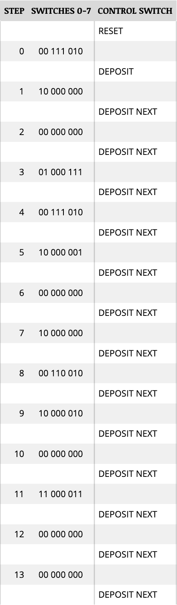

# How to Add Two Numbers

This is a program that retrieves two numbers from memory, adds them together and stores the result in memory. Here is the program in mnemonic form:

0. `LDA`
1. `MOV` (A &rarr; B)
2. `LDA`
3. `ADD` (A + B)
4. `STA`
5. `JMP`

Next, here is the lengthened explanation for each of those commands:

1. **Load Direct Address**. The CPU sends an address over the Address Bus to the Main Memory and a READ signal over the Control Bus to the Main Memory. The Main Memory then sends the data at the specified address back to the CPU over the Address Bus.
2. **Move the contents of the accumulator into register B**. When Main Memory sends the contents of the address to the CPU, it gets stored in Register `A`, which is also known as the "accumulator". Registers are small compartments of memory which the CPU can use to complete tasks. They are much faster than RAM because to access RAM you have to do an `LDA` and load the memory. Because this program involves 8-bit numbers and both of them cannot be stored in one 8-bit register at the same time, the first number mst be moved to the second register to free up the accumulator.
3. **Load the second number into the accumulator**. This step is exactly the same as step 2 except the number is being loaded from a different address.
4. **ADD the numbers together**. Now that the two numbers have been filled into registers in the CPU, they can be added with this instruction.
5. **Store the result To an Address**. Store the sum of the numbers in another address.
6. Move the instruction pointer back to the first instruction of the program.

> Once the computer has finished executing the program, it will search its memory for something else to do. The `JMP` command serves to maintain control of the CPU. The computer will "jump" back to the first instruction in the sample program and execute the program repeatedly.

With the logic of the program in place, here are the instructions for entering it:

