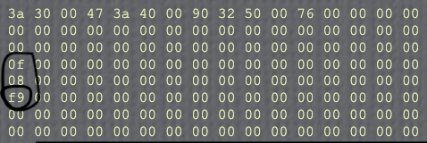

# How to Subtract Two Numbers on the *ALTAIR 8800*

This program will retrieve two numbers from memory, subtract them, and store the result in another memory slot.

This program will be very similar to the [adding two numbers](../Add_two_numbers/Add_two_numbers.md) program, in that it will follow similar instructions:

0. `LDA`
1. `MOV` (A &rarr; B)
2. `LDA`
3. `SUB` (A - B)
4. `STA`
5. `HLT`

Here are the binary instructions with their hex equivalents:

|Pneumonic|Description|Binary|Hex|
|-----------|-----------|--------|-------|
|`RESET`|Sets the program counter to the 1st memory address (00 000 000)|||
|`LDA`|Load data from an address into the accumulator. In this case, the address is byte 30.|00 111 010|3a|
|(Address byte 1)|The **less significant** byte of the address in memory.|00 110 000|30|
|(Address byte 2)|The **more significant** byte of the address in memory.|00 000 000|00|
|`MOV`|Move data in the accumulator to register `B`.|01 000 111|47|
|`LDA`|Load data from an address into the accumulator. In this case, the address is byte 40.|00 111 010|3a|
|(Address byte 1)|The **less significant** byte of the address in memory.|01 000 000|40|
|(Address byte 2)|The **more significant** byte of the address in memory.|00 000 000|00|
|`SUB`|Subtract the contents of register `B` from the contents of the accumulator.|10 010 000|90|
|`STA`|Store the contents of the accumulator to another address. In this case, the address is byte 50.|00 110 010|32|
|(Address byte 1)|The **less significant** byte of the address in memory.|01 010 000|50|
|(Address byte 2)|The **more significant** byte of the address in memory.|00 000 000|00|
|`HLT`|Halt the instruction pointer|01 001 100|76|

Next, we have to load in the data. For this first example, we will perform the operation of **5 - 3**:

|Switches 0-15|Control Switch|
|-----------|-----------|
|0 000 000 000 110 000|EXAMINE|
|0 000 000 000 000 011|DEPOSIT|
|0 000 000 001 000 000|EXAMINE|
|0 000 000 000 000 101|DEPOSIT|
||RESET|
||RUN|
||STOP|

Next, we'll try to perform the operation of **8 - 15**:

|Switches 0-15|Control Switch|
|-----------|-----------|
|0 000 000 000 110 000|EXAMINE|
|0 000 000 000 001 111|DEPOSIT|
|0 000 000 001 000 000|EXAMINE|
|0 000 000 000 001 000|DEPOSIT|
||RESET|
||RUN|
||STOP|

We should get -7. But first, let's find -7 in binary by applying [two's complement](Twos_complement.md):

7 = `0000 0111`

`0000 0111` &rarr; `1111 1000` &rarr; **`1111 1001`**

In hex, this is **f9**. And, indeed, this is what we end up getting:

